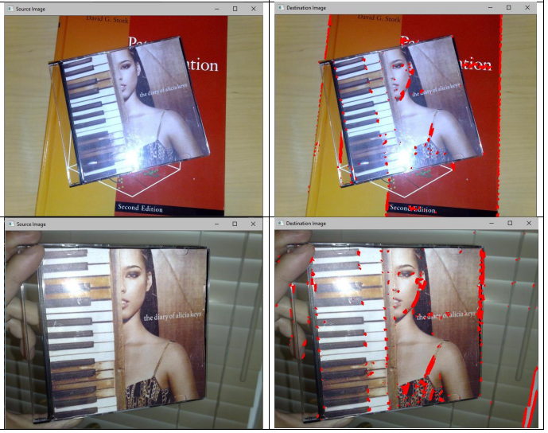

# Feature Point Detectors

Feature Point Detectors is a project implemented in C++ using OpenCV. It aims to implement various feature point detection algorithms from scratch, including Harris, Blob, Difference of Gaussians (DOG), and Scale-Invariant Feature Transform (SIFT) with K-nearest neighbors (KNN), for study purposes in the field of computer vision and image processing.

## Features

- Implementation of Harris, Blob, DOG, and SIFT feature point detection algorithms
- Study and analysis of different feature point detection techniques
- Utilizes OpenCV library for image processing operations

## Demo

## Installation

To use Feature Point Detectors, follow these steps:

1. Clone this repository to your local machine.
2. Make sure you have a C++ compiler installed.
3. Install the OpenCV library.
4. Build the project using your preferred build system.
5. Run the executable.

## Usage

Once Feature Point Detectors is running, you can:

- Load images or use provided sample images for feature point detection.
- Choose among different feature point detection algorithms to apply.
- Analyze and compare the results of different algorithms.

## Contributing

Contributions are welcome! If you have any ideas for improvements or new features, feel free to open an issue or submit a pull request.

## Acknowledgements

- Inspired by concepts in computer vision and image processing
- Implemented in C++ programming language with OpenCV library

